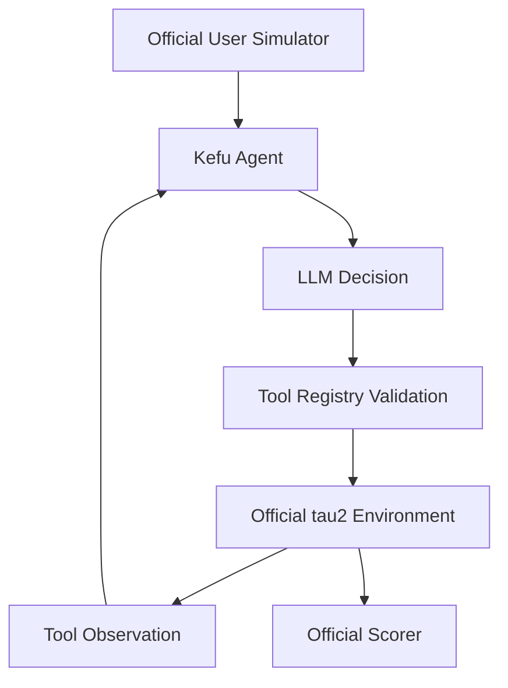

# Kefu Agent

**Transactional Customer Service Agent with Tool Calling**

## Overview

Kefu handles user intent, proposes and validates structured actions, and changes
business state through official tools. It is a tool-using customer service runtime,
not just a question-answering interface. Benchmark adapters keep environment and
scoring responsibilities separate from Agent decisions.

## Architecture



## Features

- Structured Tool Calling using the provider's native interface.
- ToolRegistry validation before official environment execution.
- Runtime Agent Identity Guard with measured counters and a blocking hook.
- Trajectory recording through AgentTrace and official simulation records.
- Benchmark evaluation using official user simulator, environment and scorer.

## Evaluation

| Certified project baseline v2 | Value |
|---|---:|
| Benchmark | tau2-bench v1.0.1 / Retail |
| Protocol | **40 tasks × 1 trial** |
| Task Success | **32/40 — 80.0%** |
| Identity guards / official scorer results | 40/40 |
| Measured official LLMAgent decisions | 0 |

This is a project measurement, not a leaderboard rank or SOTA claim. The official
test split was inspected during prior diagnostics; it is **not a pristine unseen test**.
Provider outputs are not guaranteed deterministic.

Only sanitized aggregate results and protocol are published in [results](results/).
Raw trajectories, hidden references, legacy competition data and credentials are excluded.

## Reproduction

```bash
python3.12 -m venv .venv
.venv/bin/python -m pip install -e '.[test]'
.venv/bin/python -m pytest -q
.venv/bin/python -m evaluation.runner
```

These commands verify packaging, isolated unit behavior and aggregate consistency
without API calls. Optional official-interface tests use an independently installed
fixed tau2 environment; see [reproduction](docs/reproduction.md).
The private historical run cannot be independently reconstructed from aggregate
files alone. No live benchmark is run or downloaded by this snapshot's default CLI.

## Layout

`src/kefu_runtime` contains the importable exact-source runtime. `src/agent`,
`src/tools`, `src/runtime`, `src/adapters` are navigation directories, preserving
relative imports. `evaluation` contains public metric/adapter entry points;
`tests` exercises offline contracts; `docs` describes protocol and provenance.

## Limitations

Vanilla baseline, basic schema validation, no production policy guard or intelligent
router. Known failure patterns include visible-constraint loss, fact conflicts,
confirmation/termination interactions and benchmark ambiguity. Future improvements
require train/synthetic multi-trial evidence; none is included in this release.

See [repository policy](docs/REPOSITORY_POLICY.md) and [third-party notices](THIRD_PARTY_NOTICES.md).
